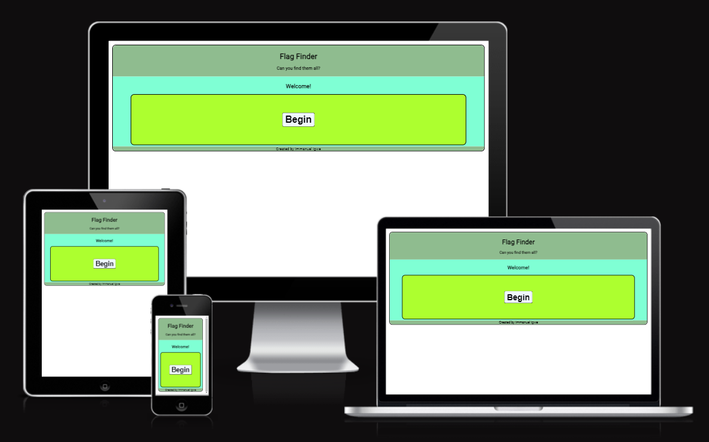
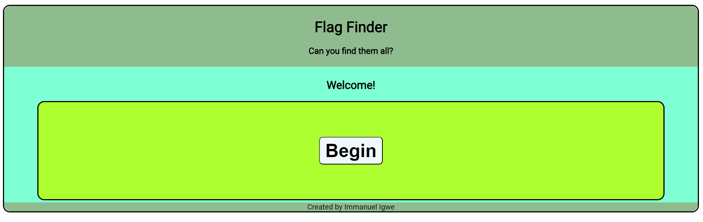
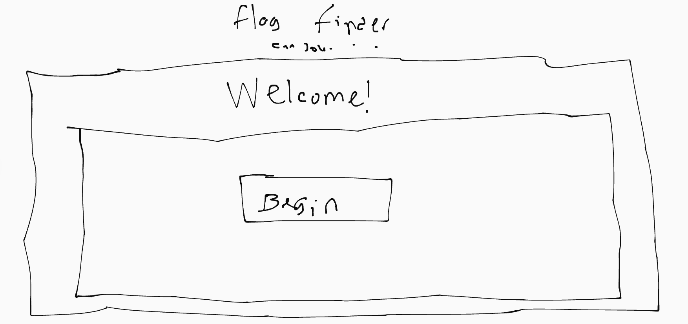
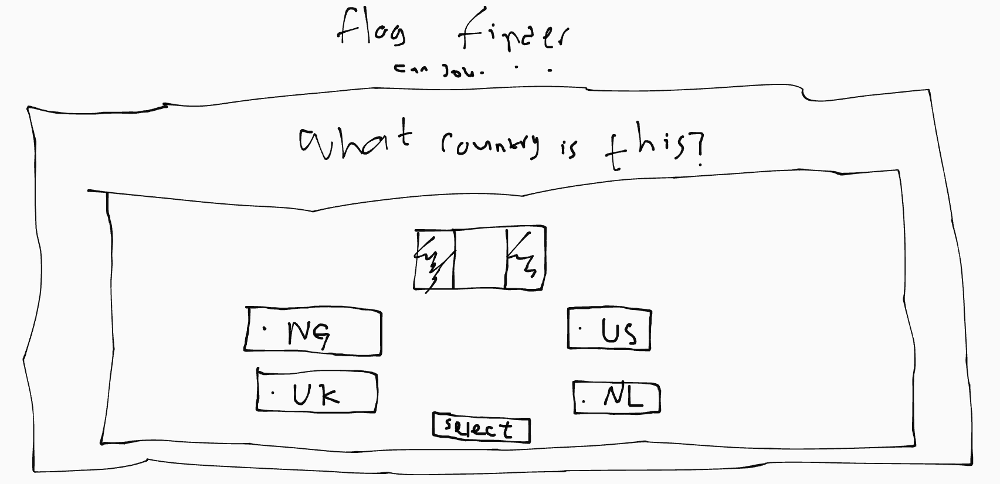
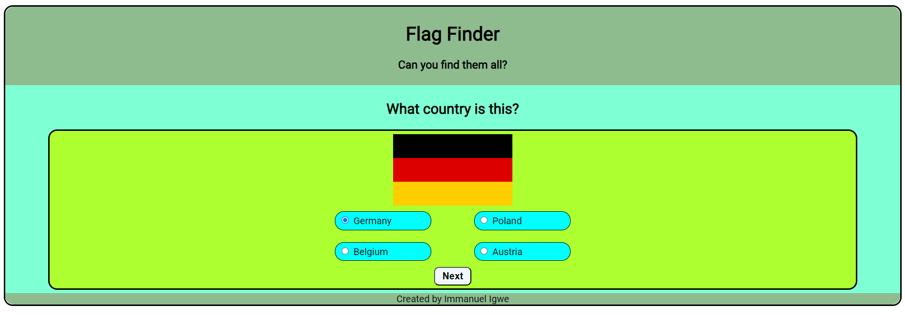
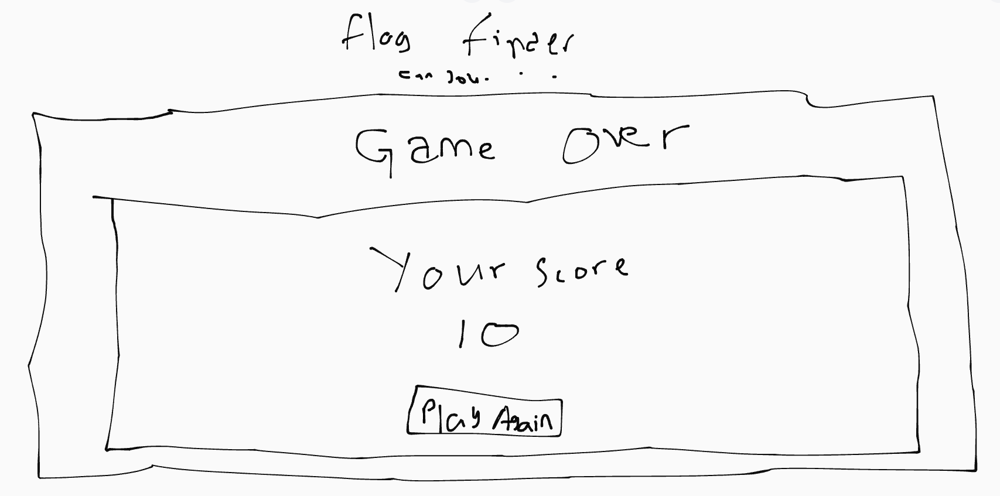
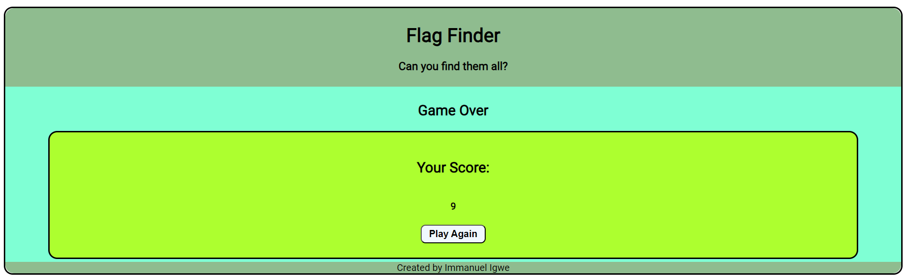
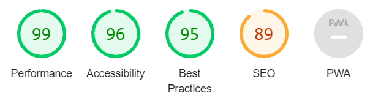

# Flag Finder

Inspired from games like GeoGuessr and Seterra, Flag Finder is a simple game in which the player attempts to guess the correct flag shown from a list of options. As someone who is a geography nerd and likes learning about countries, I decided to make this game for my second project for the Fullstack Developer course with Code Institute. I used HTML and CSS to design the visual elements of the website, and JavaScript was used to design the functionality of the website.

# Features

## Game Structure

Whilst planning for this project, I had made a rough sketch as to how the game would look like using [Canvas](https://canvas.apps.chrome). This was to give me a visual representation as to what I wanted the game to look like.

The gameplay screen was going to consist of 3 screens: the start screen (which welcomes users when the website is initially loaded), the game screen (where the user is actively playing the game) and the end screen (which displays the user's results).

## Start Screen

The image above is the sketch for the start of the game. The game was going to have a similar structure in each screen, with the content within the divs in the screens changing depending on what screen it was.

The structure for the game features a header, with the name of the game Flag Finder displayed, along with a tag text "Can you find them all?". After this was a section where I had 2 divs, one smaller one nested inside the other. Most of the game content would be in this smaller nested div, whilst the outer div olds a text which alternates between "Welcome!", "What country is this?" and "Game Over". These divs form the essential structure of the website and was built using HTML, and styled with CSS.

Below is the eventual end product:

## Game Screen

The image above is the sketch for the game screen. Here, the flag of the country would be displayed, along with a list of options for the user to choose from, and then a "Next" button which would mark this question and take them to the next one. This was mostly done with JavaScript, as it would be used to inject HTML code to build these elements. Whilst building the website, I first wrote the HTML code within the HTML document. This was to ensure that I could easily test and see what it visually looked like with the styles applied to it, after which I saved the HTML code in [HTML notes](html-notes.txt), to reuse when typing up the JavaScript code.

The country flag images were created using HTML, of which the code was obtained from [Flagpedia](https://www.flagpedia.net), a free resource for both commercial and noncommercial projects. The options were put in another div nested within the inner div, and CSS was used to style them and make them responsive to the siee of the screen using flex design.

This is the eventual end product:

## End Screen

The image above is the sketch for the end screen, after the game is done. The game would consist of 10 questions, after which the user would be scored based on how many they guessed correctly, and the score displayed on the end screen, along with a button to play again. This, again, was done with JavaScript, injecting HTML code into the HTML document.

This is the end result:

# Testing

I have tested this website using Google Chrome and Microsoft Edge on my Windows PC, adjusting the window size and seeing its outlook on different screen sizes. I have also tested it on my personal mobile device.

I have tested and confirmed that all text is easy to read.

I have tested and confirmed that the functionality works as it should.

# Bugs

Whilst testing the website, I found that there was a console error "Unchecked runtime.lastError". I was unable to figure out why it was giving this error and hence unable to fix it. This would be something that I would need to look into more.

Not necessarily a bug but more of a functionality issue: I have used radio button inputs and labels for the options and have wrapped them in spans. However, if you were to click outside of the label but within the span, the option isn't selected, so you'll have to specifically click on the label, which could be inconvenient for users.

Also not a bug but a functionality issue: I used alerts to let the user know of when their selections were right or not. Whilst still serving the purpose, they could become annoying and bring down user experience, so finding a better way of letting them know if their answer is better or not would be advisable in future improvements.

# Validator Testing

I have tested the HTML code with W3C Validator testing and there are no errors with my code. Except with the warning of my self-closing tags ending with </>, which is attributed to Codeanywhere automatically putting that when the file is saved.

I have tested the CSS code with W3C Jigsaw testing and there are no errors with my code, except with a minor issue of imported style sheets not being checked in direct input and file upload modes.

I have tested the JavaScript code using JSHint Validator and there are no errors with my code. There are some warnings with the code being potentially incompatible with some browser versions, although this doesn't affect the overall functionality of the code. 

I have tested my site's accesibility with Chrome's Lighthouse and have been given an overall score of 99%.

# Deployment

The site was deployed with GitHub pages. In the repository of this code on GitHub, the main branch was selected, and then a link was automatically generated for the website. The live link can be found [here](https://immanueligwe151.github.io/flag-finder/).

## Credits

The flag graphics were taken from [Flagpedia](https://flagpedia.net/download), and were "downloaded programmatically", using img HTML elements.
